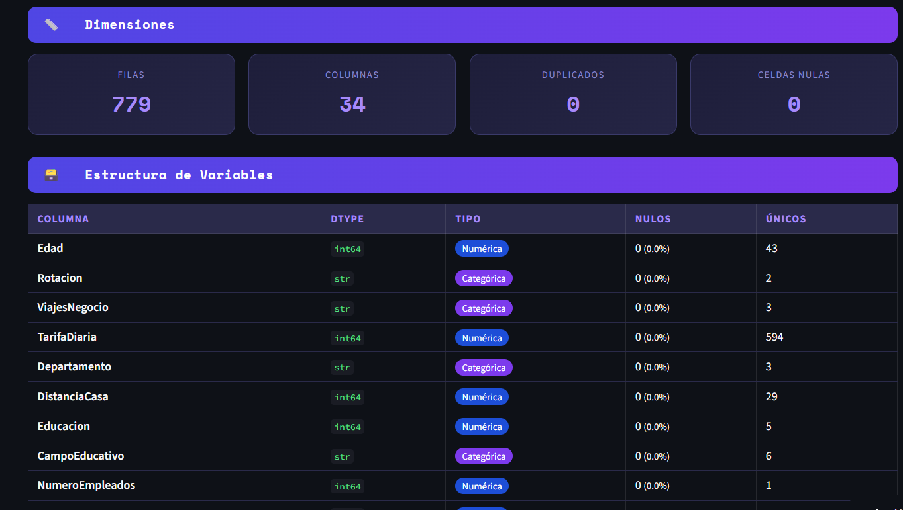
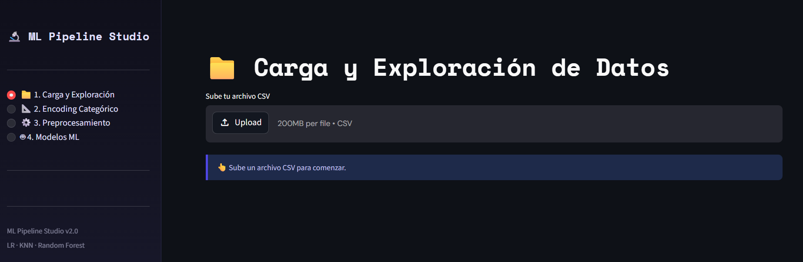
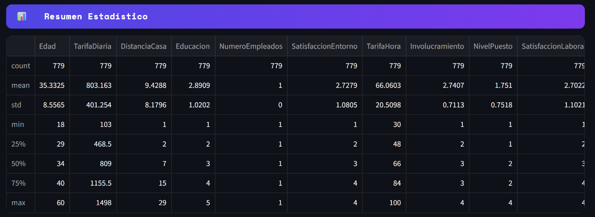
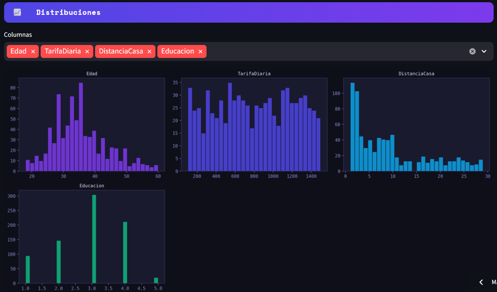
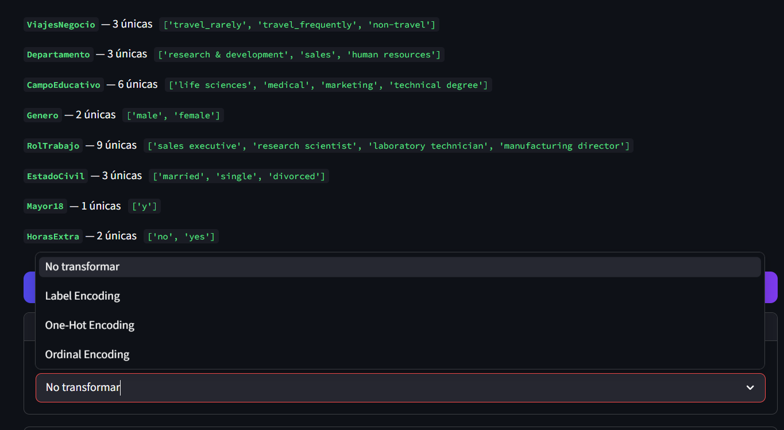
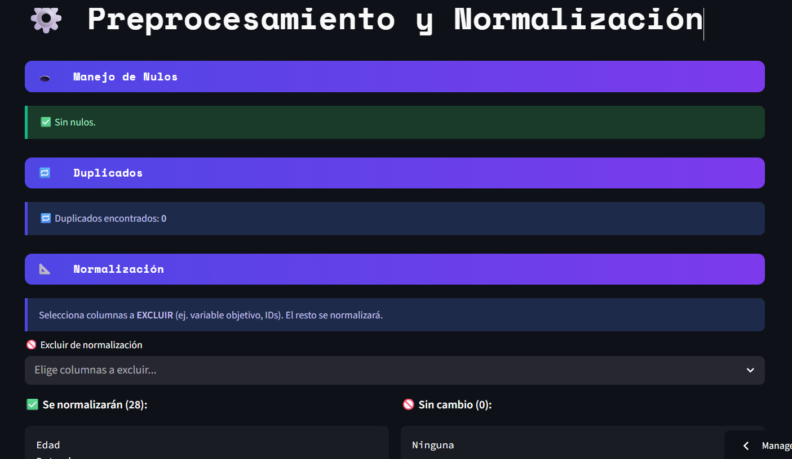
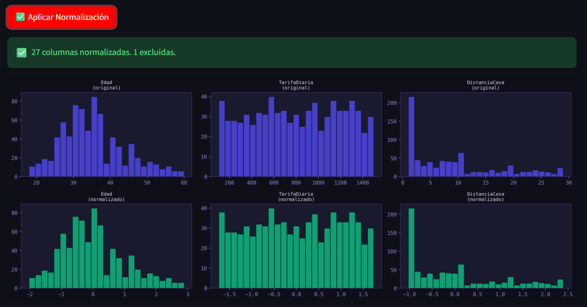
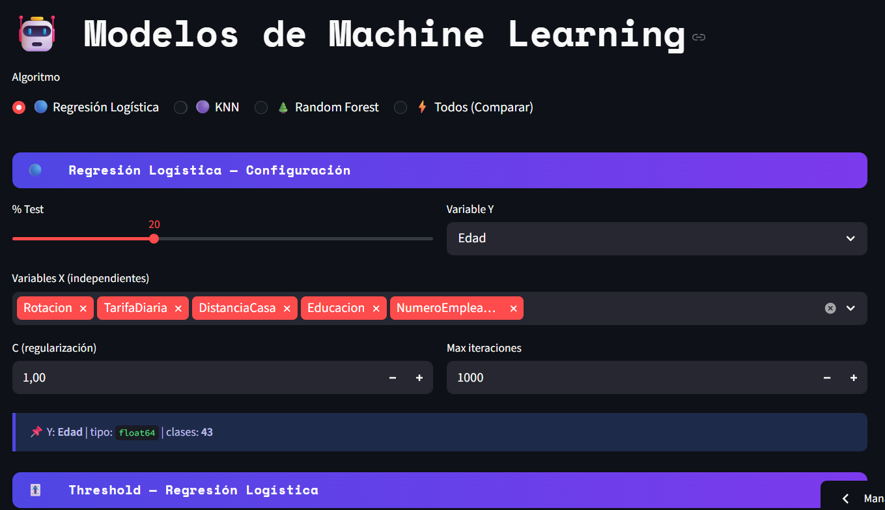

# 👥 Integrantes del Equipo

<div align="center">

| Nº | Nombre |
|----|----------|
| 1 | **Andrés Felipe Vélez** |
| 2 | **Jorge Andrés Carmona Ramírez** |
| 3 | **Juan Pablo Ocampo** |
| 4 | **Osmel Santiago Vanegas Pérez** |
| 5 | **Camilo Pérez** |

</div>


> **Proyecto desarrollado por el equipo conformado por los integrantes anteriormente mencionados.**

# 🔬 ML Pipeline Studio

Un entorno interactivo y profesional desarrollado en **Streamlit** para la automatización, análisis y despliegue de pipelines de Machine Learning. La aplicación cubre desde la carga y exploración inicial de datos hasta la normalización avanzada, entrenamiento de modelos clásicos (Regresión Logística, KNN, Random Forest) y construcción de clasificadores por Ensamble.

🌐 **Despliegue de la Aplicación:** [https://pca-rlogistica-knn.streamlit.app/](https://pca-rlogistica-knn.streamlit.app/)

🌐 **Poster explicando resultados** [PDF poster resultados](https://uconet-my.sharepoint.com/:b:/g/personal/andres_velez5136_uco_net_co/IQDOxUTg-gKFSJ1yYy4HnWrdAX4qW8Fz4REzmQri8xT8dC8?e=0fchyu/)


---

## 📸 Capturas de la Interfaz y Resultados

Para facilitar la comprensión del flujo de trabajo y la estructura visual del proyecto, se presentan las secciones clave de la aplicación:

### 1. Estructura y Flujo General
La aplicación está organizada de forma modular a través de una barra lateral intuitiva que guía al usuario por cada etapa del ciclo de vida del dato:


### 2. Carga, Inspección e Imputación de Datos
El pipeline inicia con la carga flexible de archivos CSV, detectando automáticamente las dimensiones, tipos de datos, duplicados y analizando la densidad de valores nulos por columna.


Acompañado de un resumen descriptivo completo y visualizaciones de las distribuciones de frecuencia de las variables numéricas:



### 3. Ingeniería de Características: Encoding y Normalización
Transformación robusta de variables categóricas (Label, One-Hot y Ordinal Encoding) y alineación de escalas numéricas comparando el estado original frente al preprocesado con `StandardScaler`, `MinMaxScaler` o `RobustScaler`.




### 4. Evaluación de Modelos ML y Clasificación por Ensamble
Entrenamiento dinámico con ajuste de hiperparámetros en tiempo real, curvas ROC, matrices de confusión y reportes detallados. Incluye una sección avanzada para el análisis de sesgos o desbalances comparando los modelos base frente a un Voting Classifier (Ensamble).


---

## 🛠️ Tecnologías y Requisitos

El proyecto está construido sobre el ecosistema científico de Python 3. Basado en las versiones especificadas en `requirements.txt`:

* **Streamlit** (`1.57.0`) - Framework de interfaz de usuario interactiva.
* **Scikit-Learn** (`1.8.0`) - Procesamiento, entrenamiento y métricas de Machine Learning.
* **Pandas** (`3.0.2`) & **Numpy** (`2.4.4`) - Manipulación, limpieza y estructuración de datos.
* **Matplotlib** (`3.10.8`) & **Seaborn** (`0.13.2`) - Renderizado de gráficas estadísticas y curvas de rendimiento.

---

## 🚀 Arquitectura del Pipeline (`pipeline_app.py`)

La aplicación implementa un diseño controlado por el estado de la sesión (`st.session_state`), lo que permite que las transformaciones realizadas en las primeras etapas persistan de forma segura al avanzar hacia el modelado matemático:

1. **Exploración Automatizada:** Identificación de tipos de datos, conteo de valores nulos con alertas visuales si superan el umbral crítico del 30%, y cálculo de redundancia de filas.
2. **Transformación Flexible:** Codificación selectiva de texto a representaciones vectoriales/numéricas y aislamiento de variables objetivo (`Target`) durante la normalización.
3. **Modelado Avanzado:**
   * **Regresión Logística:** Incluye slider de umbral de decisión (*threshold*) dinámico, cálculo de curvas de Precisión-Recall y mapeo del Top 10 de coeficientes positivos/negativos.
   * **K-Nearest Neighbors (KNN):** Incorpora un gráfico de codo (*Elbow Plot*) interactivo que mapea el error frente al valor de $K$ para determinar el vecino óptimo.
   * **Random Forest:** Visualización nativa de la importancia de características (*Feature Importance*) basada en la ganancia de información.
4. **Validación Cruzada Estratificada:** Implementación de `StratifiedKFold` para evaluar la estabilidad del modelo frente a datos no vistos sin riesgo de sobreajuste.
5. **Estrategia de Ensamble:** Fusión inteligente mediante votación dura (*Hard Voting*), blanda (*Soft Voting*) o ponderada personalizada.

---

## 💻 Instalación y Uso Local

Si deseas ejecutar este estudio de pipelines en tu máquina local, sigue estos pasos:

1. **Clonar el repositorio:**
   ```bash
   git clone <URL_DE_TU_REPOSITORIO>
   cd <NOMBRE_DEL_REPOSITORIO>

### Instrucciones para ejecutarlo:
1. Abre tu terminal en la raíz de tu proyecto.
2. Si creaste el archivo `.sh`, dale permisos de ejecución ejecutando: `chmod +x setup_readme.sh`
3. Ejecútalo con: `./setup_readme.sh` (o simplemente copia y pega todo el bloque de código directamente en la terminal).